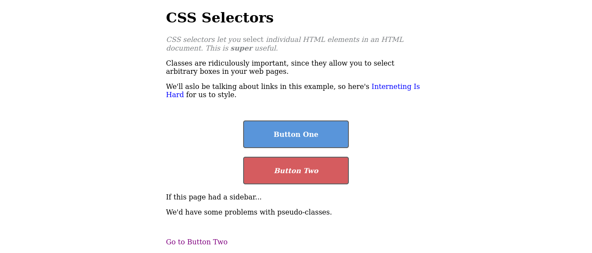

# Interneting Is Hard - CSS Selectors

This is a solution to the [CSS Selectors tutorial No. 6 of HTML & CSS Is Hard](https://www.internetingishard.com/html-and-css/css-selectors/).

## Table of contents

- [Overview](#overview)
  - [Screenshot](#screenshot)
  - [Links](#links)
- [My process](#my-process)
  - [Built with](#built-with)
  - [What I learned](#what-i-learned)
  - [Continued development](#continued-development)
  - [Useful resources](#useful-resources)
- [Author](#author)
- [Acknowledgments](#acknowledgments)

## Overview

### Screenshot



### Links

- Solution URL: [CSS Selectors solution](https://github.com/jugglingdev/css-selectors)
- Live Site URL: [CSS Selectors live site](https://jugglingdev.github.io/css-selectors/)

## My process

### Built with

- HTML5
- CSS

### What I learned

While I'd already learned about type selectors in previous tutorials, this tutorial covered class selectors, descendant selectors, pseudo-classes, and ID selectors.

I really got to see how setting up `<div>` elements with classes helps with styling a page.  I also saw once again how convenient it is to make reusable code with selectors.

By the way, pseudo-classes are cool!  I learned about the classic link styles including:
- `:link`
- `:visited`
- `:hover`
- `:active`

Other pseudo-classes in this tutorial were `:last-of-type` and `:first-of-type`.

As far as ID selectors go, I learned that it's best to avoid them for the sake of preserving URL fragments.  It can get messy to use a bunch of `id` attributes for both URL fragments and styling, especially if you go to edit the URLs of multiple sections and forget to update the stylesheet.

*Side-note: I noticed that markdown uses `#` for URL fragments in this very doc!  Neat connection!*

The last topic was on specificity, which goes from greatest to least like this:
- `#id`
- `.class:pseudo-class`
- `type:pseudo-class` and `.class descendant-type`
- `.class`
- `type`

New code snippets from this tutorial include:

```css
/* Classic psuedo-class styles for links */
a:link {
  color: blue;
  text-decoration: none;
}
a:visited {
  color: purple;
}
a:hover {
  color: aqua;
  text-decoration: underline;
}
a:active {
  color: red;
}

/* Optional add-ons */
a:visited:hover {
  color: orange;
}
a:visited:active {
  color: red;
}
```

```html
<!-- URL fragment from the same page -->
<a href="#fragment">Go to fragment</a>

<!-- URL fragment from a different page -->
<a href="/path/#fragment">Go to fragment</a>
```

### Continued development

One topic brought up was child selectors, a stricter variant of the descendant selector because of its requirement that the second selector must be a direct child of the first.  I'm interested to see where this will turn up.

I'm also super curious about other use cases for pseudo-classes.  There's a certain amount of mystery about them that I find intriguing.

Finally, URL fragments were touched on in this tutorial, but I'd like to work with them more in bigger projects.

### Useful resources

- [MDN Child Combinator](https://developer.mozilla.org/en-US/docs/Web/CSS/Child_combinator) - A look at child selectors, a stricter selector than descendant selectors as the second selector must be a direct child of the first.

- [MDN Pseudo-Classes](https://developer.mozilla.org/en-US/docs/Web/CSS/Pseudo-classes) - More pseudo-classes!

- [BEM](https://getbem.com/introduction/) - A methodology for structured CSS that makes *everything* a class selector.

## Author

- GitHub - [@jugglingdev](https://github.com/jugglingdev)

- freeCodeCamp - [@jugglingdev](https://www.freecodecamp.org/jugglingdev)

- Frontend Mentor - [@jugglingdev](https://www.frontendmentor.io/profile/jugglingdev)

- LinkedIn - [Kayla Paden](https://www.linkedin.com/in/kayla-marie-paden)

## Acknowledgments

Shoutout to Oliver James for his dedication to publishing and maintaining InternetingIsHard.com.  His tutorials were the first that really clicked for me.